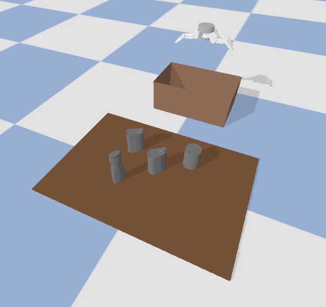
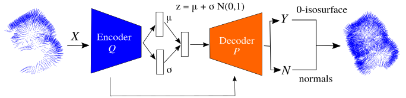

# geometric-object-grasper
This repository is an implementation of the paper 'A Geometric Approach for Grasping Unknown Objects with Multi-Fingered Hands' in PyBullet. Note that this is a Python implementation and as a result it runs slower than the initial C++ implementation.

## Installation
```shell
git clone git@github.com:mkiatos/geometric-object-grasper.git
cd geometric-object-grasper

virtualenv ./venv --python=python3
source ./venv/bin/activate
pip install -e .
```

In this implementation PytTorch 1.9.0 was used:
```shell
pip install torch==1.9.0+cu111 torchvision==0.10.0+cu111 torchaudio==0.9.0 -f https://download.pytorch.org/whl/cu111/torch_stable.html
```

## Quick Demo

This demo runs our pre-trained model with a floating Barrett Hand in simulation on unseen object set and 
the goal is to grasp every object in the scene. First download the pre-trained model of the shape completion network:

```commandline
cd downloads
./download-weights.sh
cd ..
```
and then run the following command:
```commandline
cd scripts/
python run.py --n_episodes 10 --plot
```
If you want to run the demo with different parameters, edit the yaml/params.yml file.

<!--
## Shape Completion Network
<p align="center">
  
</p>

If you want to train the Shape completion network from scratch, follow the next steps.
### Data generation 
To collect data for training the Shape Completion network, first generate the partial point clouds for each model:
```commandline
python generate_partial_pcd.py --object_set seen --n_views 5 --log_dir path-to-log-dir
```
Then, to generate the grid pairs, run the following command:
```commandline
python collect_data.py --seed 0 --n_samples 100 --pcd_dir path-to-partial-pcd-dir --log_dir path-to-log-dir
```
This may take some time. You could run multiple times the collect_data.py in parallel with different seeds and then merge the log_dirs.

### Training
Finally, for training the network from scratch:
```commandline
python train_shape_net.py --dataset_dir path_to_dataset --epochs 100 --batch_size 32 --lr 0.0001
```

### Evaluation
```commandline
python eval_shape_net.py --snapshot_file path-to-model --test_data_dir path-to-test-data
```
 -->

## Citing
If you find this code useful in your work, please consider citing:
```shell
@article{kiatos2020geometric,
  title={A geometric approach for grasping unknown objects with multifingered hands},
  author={Kiatos, Marios and Malassiotis, Sotiris and Sarantopoulos, Iason},
  journal={IEEE Transactions on Robotics},
  volume={37},
  number={3},
  pages={735--746},
  year={2020},
  publisher={IEEE}
}
```

## Acknowledgements
The floating Barrett code was developed by [Slifer64][1]

[1]: https://github.com/Slifer64